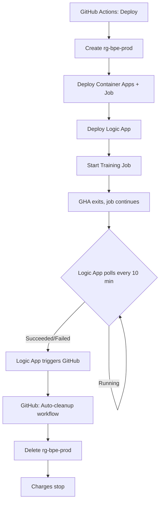

# Azure Container Apps Deployment Guide

## Problem Statement

You successfully ran a BPE tokenizer training workflow on Azure Container Apps with a **consumption profile**, but discovered that:
1. Azure doesn't support switching an existing environment from consumption to dedicated profile
2. Dedicated profiles incur charges 24/7, even when idle
3. You need 100GB+ memory for large-scale training

## Solution: Multi-Environment Architecture

This guide implements an **industry best practice** solution using:
- **Separate resource groups** for dev and prod environments
- **Shared resources** (ACR, Storage) in a long-lived RG
- **Ephemeral dedicated environments** that auto-delete after training
- **Azure Logic Apps** for automated monitoring and cleanup

---

## Architecture

```
┌─────────────────────────────────────────┐
│  bpe-rg (shared, persistent)            │
│  - Azure Container Registry (zhlacr)    │
│  - Storage Account (transformer336zhl)  │
│  - Azure Files share (cs336zhl)         │
│  - Blob container (bpe-artifacts)       │
└─────────────────────────────────────────┘
         ↑                          ↑
         │                          │
┌────────┴────────┐      ┌─────────┴─────────┐
│  Dev Env        │      │  Prod Env         │
│  bpe-rg         │      │  rg-bpe-prod      │
│  (Consumption)  │      │  (Dedicated D32)  │
│  Persistent     │      │  Ephemeral        │
└─────────────────┘      └───────────────────┘
```

**Key principles:**
1. **Shared resources** (ACR, Storage) live in `bpe-rg` - never deleted
2. **Dev environment** uses consumption profile - cost-effective for testing
3. **Prod environment** uses dedicated profile - deployed on-demand, auto-deleted after use
4. **Cross-RG references** - prod environment references shared resources from `bpe-rg`

---

## Quick Start

### 1. One-Time Setup

**Create GitHub PAT:**
```bash
# Required for Logic App to trigger cleanup workflow
# GitHub Settings → Developer settings → PAT → Fine-grained tokens
# Scope: repo (full control of repositories)
```

Add to GitHub secrets as `GH_PAT`

**Verify Azure credentials:**
```bash
# Ensure these are set as GitHub secrets:
# - AZURE_CLIENT_ID
# - AZURE_TENANT_ID
# - AZURE_SUBSCRIPTION_ID
```

### 2. Deploy Development Environment

```bash
# Uses consumption profile (pay-per-use)
az deployment group create \
  --resource-group bpe-rg \
  --template-file infra/main.bicep \
  --parameters @infra/dev.bicepparam
```

**When to use:** Testing, small datasets, development iterations

### 3. Deploy Production Environment (Automated)

```bash
# Deploys dedicated D32 (128 GiB RAM) with auto-cleanup
gh workflow run deploy-dedicated.yml \
  -f imageTag=latest \
  -f vocabSize=32000 \
  -f cpu=32 \
  -f memory=120Gi \
  -f autoCleanup=true
```

**What happens:**
1. ✅ GitHub Actions creates `rg-bpe-prod` resource group
2. ✅ Deploys Container Apps environment with D32 dedicated profile
3. ✅ Starts training job
4. ✅ Deploys Azure Logic App to monitor job status
5. ✅ Logic App polls job every 10 minutes
6. ✅ When job completes → Logic App triggers cleanup workflow
7. ✅ Cleanup workflow deletes entire `rg-bpe-prod` resource group
8. ✅ No charges after deletion completes (~5 min)

**When to use:** Large-scale training (100GB+ memory), production workloads

---

## Files Overview

### Infrastructure (Bicep)

| File | Purpose |
|------|---------|
| [`infra/main.bicep`](infra/main.bicep) | Main template - supports both consumption and dedicated profiles |
| [`infra/dev.bicepparam`](infra/dev.bicepparam) | Dev environment config (consumption profile) |
| [`infra/prod.bicepparam`](infra/prod.bicepparam) | Prod environment config (dedicated D32 profile) |

**Key features in `main.bicep`:**
- Cross-RG resource references via `acrResourceGroup` and `storageResourceGroup` parameters
- Conditional workload profile creation based on `dedicatedProfileSku` parameter
- Each environment gets its own UAMI for isolation
- Shared resources (ACR, Storage) referenced via `existing` keyword

### Workflows

| File | Trigger | Purpose |
|------|---------|---------|
| [`.github/workflows/deploy-dedicated.yml`](.github/workflows/deploy-dedicated.yml) | Manual | Deploy prod environment + start training + setup Logic App |
| [`.github/workflows/auto-cleanup.yml`](.github/workflows/auto-cleanup.yml) | Logic App | Auto-delete resource group when training completes |
| [`.github/workflows/cleanup.yml`](.github/workflows/cleanup.yml) | Manual | Manual cleanup (fallback option) |

---

## Cost Analysis

### Development Environment (Consumption)
- **Idle cost:** $0
- **Running cost:** ~$0.01/min
- **Typical run:** $0.10-1.00
- **Use case:** Testing, small datasets

### Production Environment (Dedicated D32)
- **Profile:** 32 vCPU, 128 GiB RAM
- **Cost:** ~$1.20/hour (24/7 if not deleted!)
- **10-hour training:** ~$12
- **With auto-cleanup:** No additional charges after deletion
- **Without cleanup:** Continues charging indefinitely ⚠️

**Example scenario:**
- Deploy at 9:00 AM
- Training runs for 8 hours (completes at 5:00 PM)
- Logic App detects completion within 10 minutes (5:10 PM)
- Cleanup triggered, RG deletion takes 5 minutes (5:15 PM)
- **Total charges:** 8.25 hours × $1.20 = **~$10**

---

## Automation Flow (Logic Apps)



**Logic App definition:**
- **Trigger:** Recurrence (every 10 minutes)
- **Action 1:** HTTP GET to Azure API - check job status
- **Action 2:** If job complete → HTTP POST to GitHub API - trigger `repository_dispatch`
- **Action 3:** Terminate Logic App (self-destruct)

**Key benefits:**
- ✅ No GitHub Actions timeout (6-hour limit bypassed)
- ✅ Native Azure integration (uses Managed Identity)
- ✅ Fully automated - zero manual intervention
- ✅ Idempotent - safe to run multiple times
- ✅ Cost-effective (~$0.10/month for Logic App)

---

## Manual Operations

### Check job status
```bash
az containerapp job execution list \
  --resource-group rg-bpe-prod \
  --name bpeprod-train \
  --output table
```

### Stream logs
```bash
az containerapp job execution logs show \
  --resource-group rg-bpe-prod \
  --name bpeprod-train \
  --execution <execution-id> \
  --follow
```

### Manual cleanup (if autoCleanup=false)
```bash
gh workflow run cleanup.yml \
  -f resourceGroup=rg-bpe-prod \
  -f namePrefix=bpeprod \
  -f confirmResourceGroup=rg-bpe-prod \
  -f deleteResourceGroup=true
```

---

## Troubleshooting

### Logic App not triggering cleanup

**Check Logic App runs:**
```bash
az logic workflow list \
  --resource-group rg-bpe-prod \
  --output table

az logic workflow show \
  --resource-group rg-bpe-prod \
  --name bpeprod-cleanup-monitor \
  --query state
```

**Common issues:**
1. GitHub PAT not set or expired → Update `secrets.GH_PAT`
2. Logic App identity missing Reader role → Assigned automatically, but check:
   ```bash
   az role assignment list \
     --scope /subscriptions/<sub-id>/resourceGroups/rg-bpe-prod \
     --output table
   ```
3. Job status API call failing → Check Logic App run history in Azure Portal

**Workaround:** Manually trigger cleanup workflow

### Deployment fails with "workload profile not found"

**Cause:** Dedicated profile not created or misspelled

**Fix:** Verify `dedicatedProfileSku` and `workloadProfileName` match in `prod.bicepparam`:
```bicep
param workloadProfileName = 'Dedicated'  // Must match
param dedicatedProfileSku = 'D32'        // Must be valid SKU
```

### Training job OOM (Out of Memory)

**Current allocation:** 120 GiB RAM (D32 profile has 128 GiB total)

**Solutions:**
1. Reduce vocab size or dataset size
2. Upgrade to larger profile (no D64, max is D32 - consider AKS for larger)
3. Implement memory-efficient training (streaming, batching)

---

## Best Practices

### ✅ DO

1. **Always enable autoCleanup** for production runs
2. **Monitor email alerts** (configured in Bicep)
3. **Test with dev environment first** before prod
4. **Tag resources** for cost tracking:
   ```bicep
   tags: {
     environment: 'prod'
     purpose: 'bpe-training'
     ephemeral: 'true'
   }
   ```
5. **Use separate RGs** for dev and prod

### ❌ DON'T

1. **Never delete `bpe-rg`** - contains shared resources
2. **Don't deploy dedicated without cleanup** - wastes money
3. **Don't stream logs in GHA for 10+ hour jobs** - hits timeout
4. **Don't hardcode secrets** - use GitHub Secrets and Azure Key Vault

---

## Advanced: Alternative Solutions Considered

### 1. Event Grid + Azure Functions
**Pros:** Event-driven, instant response
**Cons:** Requires custom code, more complex
**Verdict:** Overkill for this use case

### 2. Manual cleanup with scheduled workflow
**Pros:** Simple, no Logic Apps
**Cons:** Guessing completion time = wasted money or early termination
**Verdict:** Not reliable for variable-length training

### 3. GitHub Actions with sleep loop
**Pros:** All in one workflow
**Cons:** 6-hour timeout, wastes GHA minutes
**Verdict:** Won't work for 10+ hour training

### 4. Azure Container Instances (ACI)
**Pros:** Simpler than Container Apps, no environment overhead
**Cons:** No built-in job scheduling, less integrated
**Verdict:** Valid alternative for one-off runs

**Chosen solution (Logic Apps)** balances automation, cost, reliability, and Azure-native integration.

---

## Summary

This solution provides:
- ✅ **No environment switching issues** - deploys fresh environments on-demand
- ✅ **100GB+ memory support** - uses D32 dedicated profile (128 GiB RAM)
- ✅ **Zero idle charges** - auto-deletes environments after training
- ✅ **Industry best practices** - separation of concerns, ephemeral infra, automated cleanup
- ✅ **Fully automated** - Logic Apps handle monitoring and cleanup
- ✅ **Safe** - prevents accidental deletion of shared resources

**Next steps:**
1. Set up GitHub PAT (`GH_PAT` secret)
2. Test dev deployment: `az deployment group create ... @infra/dev.bicepparam`
3. Run production training: `gh workflow run deploy-dedicated.yml`
4. Monitor email for completion notification
5. Verify auto-cleanup succeeded (check Azure Portal - RG should be gone)