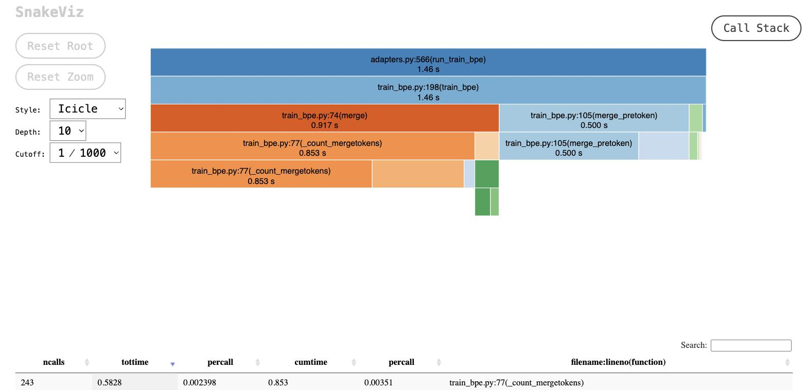
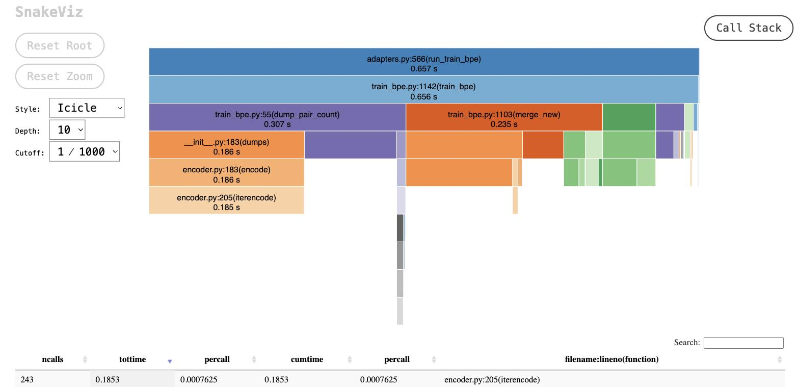
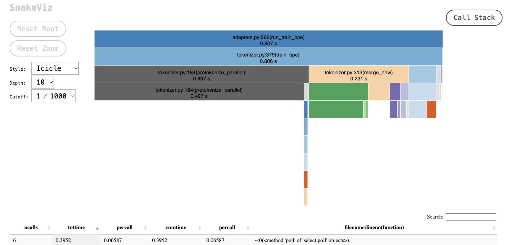
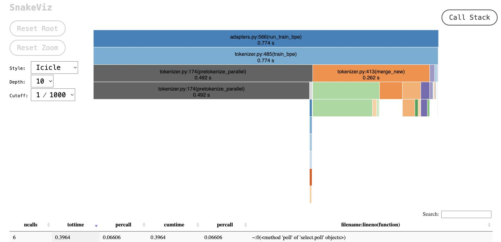

# BPE Tokenizer

- Repo: [`zhL-d/llm-from-scratch`](https://github.com/zhL-d/stf-assignment1-basics)
- [PR #1](https://github.com/zhL-d/stf-assignment1-basics/pull/1)

## Baseline: the first working version

**Code**:

- [`627d451`](https://github.com/zhL-d/stf-assignment1-basics/commit/627d451) "first working version"

The [main loop](https://github.com/zhL-d/stf-assignment1-basics/blob/627d451/cs336_basics/train_bpe.py#L198-L226).

**Profiling**:

```bash
TRAINDATA_PATH=tests/fixtures/corpus.en VOCAB_SIZE=500 uv run python -m cProfile -s cumtime -m cs336_basics.train_bpe
```

(full file:
[`cs336_basics/profile/writeup/baseline-627d451-from-prof.txt`](../cs336_basics/profile/writeup/baseline-627d451-from-prof.txt):


```
         12413797 function calls (12413700 primitive calls) in 1.463 seconds

   Ordered by: cumulative time

   ncalls  tottime  percall  cumtime  percall filename:lineno(function)
        1    0.000    0.000    1.463    1.463 adapters.py:566(run_train_bpe)
        1    0.010    0.010    1.463    1.463 train_bpe.py:198(train_bpe)
      243    0.000    0.000    0.917    0.004 train_bpe.py:74(merge)
      243    0.583    0.002    0.853    0.004 train_bpe.py:77(_count_mergetokens)
      243    0.367    0.002    0.500    0.002 train_bpe.py:105(merge_pretoken)
  4525881    0.244    0.000    0.244    0.000 {method 'get' of 'dict' objects}
  6828662    0.162    0.000    0.162    0.000 {built-in method builtins.len}
      243    0.000    0.000    0.064    0.000 train_bpe.py:88(_pick_best_mergetoken)
```


the total time is 1.463 seconds, with `_count_mergetokens` (0.853s) + `merge_pretoken` (0.500s)
together account for ~92% of `train_bpe`'s total time.




**The Problem**:

The speed is less than ideal, every single merge iteration, [`_count_mergetokens`](https://github.com/zhL-d/stf-assignment1-basics/blob/627d451/cs336_basics/train_bpe.py#L74-L100) rebuilds pair-frequency
counts by rescanning every pre-token in the entire corpus from scratch,
and [`merge_pretoken`](https://github.com/zhL-d/stf-assignment1-basics/blob/627d451/cs336_basics/train_bpe.py#L105-L117) rewrites every pre-token to check whether it
contains the merged pair, there's no notion of "only touch what changed."

## Optimization 
### Round 1: incremental pair-count updates

- [`46e620a`](https://github.com/zhL-d/stf-assignment1-basics/commit/46e620a) "performance optimization"

this commit fixes the "rescan everything on every merge" problem by using a reverse index mapping each pair to the pre-tokens that contain it, [`build_paircount_and_cache`](https://github.com/zhL-d/stf-assignment1-basics/blob/46e620a/cs336_basics/train_bpe.py#L1006-L1021).

What makes the update *incremental*: `pair_counts` is never rebuilt from
scratch after a merge, it's patched in place. [`merge_new`](https://github.com/zhL-d/stf-assignment1-basics/blob/46e620a/cs336_basics/train_bpe.py#L1103-L1120)
looks up only the pre-tokens containing the merged pair via
`reversed_cache[best_pair]`, then for each one subtracts its old pair
contributions and adds back its new ones. The cost of a merge now scales
with how many pre-tokens it actually touched, not with the size of the
whole corpus.

**Benchmark**:

```bash
TRAINDATA_PATH=tests/fixtures/corpus.en VOCAB_SIZE=500 uv run python -m cProfile -s cumtime -m cs336_basics.train_bpe
```

(full file: [`cs336_basics/profile/writeup/round1-46e620a.txt`](../cs336_basics/profile/writeup/round1-46e620a.txt)):

```
         1694594 function calls (1694497 primitive calls) in 0.657 seconds

   ncalls  tottime  percall  cumtime  percall filename:lineno(function)
        1    0.005    0.005    0.656    0.656 train_bpe.py:1142(train_bpe)
      243    0.110    0.000    0.307    0.001 train_bpe.py:55(dump_pair_count)
      243    0.049    0.000    0.235    0.001 train_bpe.py:1103(merge_new)
    15404    0.127    0.000    0.139    0.000 train_bpe.py:1083(_add_new_contribution)
      243    0.000    0.000    0.064    0.000 train_bpe.py:1123(_pick_best_mergetoken)
  245/244    0.041    0.000    0.063    0.000 {built-in method builtins.max}
   836665    0.023    0.000    0.023    0.000 train_bpe.py:1127(<lambda>)
```

`train_bpe`'s total drops to 0.657s, down from ~2.108s at baseline, 
roughly **3.2x faster** from this change alone. `merge_new` (0.235s) and
`_add_new_contribution` (0.139s) now dominate instead of the old
`_count_mergetokens`/`merge_pretoken` rescans.



### Round 2: parallel pre-tokenization

- [`e344197`](https://github.com/zhL-d/stf-assignment1-basics/commit/e344197) "add parallel"

Pre-tokenization was parallelized across processes, on the assumption that
splitting the corpus into chunks and pre-tokenizing them concurrently would
speed things up:

(full file: [`serial-30a0a65.txt`](../cs336_basics/profile/writeup/serial-30a0a65.txt) / [`parallel-e344197.txt`](../cs336_basics/profile/writeup/parallel-e344197.txt)):

```
# serial (30a0a65):
        1    0.028    0.028    0.045    0.045 tokenizer.py:79(pretokenize_and_count)

# parallel (e344197):
        1    0.000    0.000    0.497    0.497 tokenizer.py:184(pretokenize_parallel)
```

Parallelizing made the pre-tokenization step itself **~11x slower** (0.045s → 0.497s), process-spawn
and inter-process communication overhead dwarfs the actual work on a corpus
this small. It might pay off once a corpus is large enough to amortize that fixed
overhead, but at this benchmark's scale, serial is simply faster.



### Round 3: heap-based pair selection

- [`45fe159`](https://github.com/zhL-d/stf-assignment1-basics/commit/45fe159)
- [`813aa30`](https://github.com/zhL-d/stf-assignment1-basics/commit/813aa30) "complete heap perf optimazation"

Round 1 fixed the rescan problem but left one thing untouched: picking the
next pair to merge was still a linear scan over every current pair, every
merge. This round replaces that scan with a heap.

Before ([`7e710b2`](https://github.com/zhL-d/stf-assignment1-basics/blob/7e710b2/cs336_basics/tokenizer.py#L204-L214)):
a plain `max()` over all pairs, called once per merge. After
([`813aa30`](https://github.com/zhL-d/stf-assignment1-basics/blob/813aa30/cs336_basics/tokenizer.py#L234-L266)):
a heap of `(-count, pair)`, with lazy deletion for entries whose count went
stale after a merge.

(full file: [`before-7e710b2.txt`](../cs336_basics/profile/writeup/before-7e710b2.txt) / [`after-813aa30.txt`](../cs336_basics/profile/writeup/after-813aa30.txt)):

```
# before (7e710b2): 1,405,990 function calls, 0.768s train_bpe cumtime
      243        0.000    0.000    0.064    0.000 tokenizer.py:203(_pick_best_mergetoken)
      253        0.041    0.000    0.064    0.000 {built-in method builtins.max}

# after (813aa30): 764,739 function calls, 0.774s train_bpe cumtime
      243    0.000    0.000    0.004    0.000 tokenizer.py:240(update_heap)
      243    0.000    0.000    0.002    0.000 tokenizer.py:257(_pick_best_mergetoken)
```

Pair selection alone drops from 0.064s to ~0.006s, about **10.7x cheaper**
for that specific step.



### Round 4: seven small CPython-level tweaks

- [`3dab21c`](https://github.com/zhL-d/stf-assignment1-basics/commit/3dab21c) "Refactor for performance boost"
- [`6964578`](https://github.com/zhL-d/stf-assignment1-basics/commit/6964578) "optimization by remove duplication computation and reduce duplicate look up"
- [`01f7c5c`](https://github.com/zhL-d/stf-assignment1-basics/commit/01f7c5c) "optimize perf by local bound trick"
- [`409a2c3`](https://github.com/zhL-d/stf-assignment1-basics/commit/409a2c3) "Refactor pretokenize_and_count by unnecessary loop"
- [`019da3b`](https://github.com/zhL-d/stf-assignment1-basics/commit/019da3b) "optimize _build_new_pretoken by using list operation instead of tuple"
- [`f7cddd1`](https://github.com/zhL-d/stf-assignment1-basics/commit/f7cddd1) "local length compute"
- [`dd1243d`](https://github.com/zhL-d/stf-assignment1-basics/commit/dd1243d) "add cache for bytes to tuple byte for building pretoken"

Unlike Rounds 1-3, none of these change the algorithm. They're seven small
CPython-level tweaks, each targeting one function. 

**Benchmark**:

```bash
TRAINDATA_PATH=tests/fixtures/corpus.en VOCAB_SIZE=500 uv run python -m cProfile -s cumtime -m cs336_basics.train_bpe
```

#### 1. Precompile the regex pattern, `3dab21c`

[Before](https://github.com/zhL-d/stf-assignment1-basics/blob/813aa30/cs336_basics/tokenizer.py#L126-L145):
`re.finditer(PAT, doc)` recompiles the pattern on every call. [After](https://github.com/zhL-d/stf-assignment1-basics/blob/3dab21c/cs336_basics/tokenizer.py#L151-L170): the pattern is compiled once at module scope (`PAT = re.compile(PAT_PATTERN)`) and reused.

(full file: [`round4-serial-step0-813aa30.txt`](../cs336_basics/profile/writeup/round4-serial-step0-813aa30.txt) / [`round4-serial-step1-3dab21c.txt`](../cs336_basics/profile/writeup/round4-serial-step1-3dab21c.txt)):

```
# before (813aa30): pretokenize_and_count tottime 0.020s, cumtime 0.033s
# after  (3dab21c):  pretokenize_and_count tottime 0.020s, cumtime 0.032s
```

No measurable change. 

#### 2. Dedupe the pair slice + bind `.get` locally, `6964578`

`build_paircount_and_cache`
used to slice `k[i:i+2]` twice per pair (once for the count, once for the
cache) and call `pair_count.get(...)` as a fresh attribute lookup every
iteration. After [change](https://github.com/zhL-d/stf-assignment1-basics/blob/6964578/cs336_basics/tokenizer.py#L263-L284): the slice is computed once into
`pair`, and `pc_get = pair_count.get` is bound before the loop.

full file: [`round4-serial-step2-6964578.txt`](../cs336_basics/profile/writeup/round4-serial-step2-6964578.txt)

```
# before (3dab21c): build_paircount_and_cache tottime 0.007s, cumtime 0.010s
# after  (6964578):  build_paircount_and_cache tottime 0.005s, cumtime 0.009s
```

A real, if small, win for the targeted function, 
this function is only ~10ms so it doesn't move the
total meaningfully, but it's the correct direction.

#### 3. "Local bound trick", `01f7c5c`

The same `method_get = obj.get` pattern from step 2 is applied to four
more functions: `pretokenize_and_count`,
`pretokenize_parallel`, `_delete_old_contribution`, and
`_add_new_contribution`. `obj.get` is a
fresh attribute lookup every time, binding it once turns
that into a local variable read.

full file: [`round4-serial-step3-01f7c5c.txt`](../cs336_basics/profile/writeup/round4-serial-step3-01f7c5c.txt)

```
# before (6964578): pretokenize_and_count 0.020s/0.032s, _delete_old_contribution 0.031s/0.045s
# after  (01f7c5c):  pretokenize_and_count 0.020s/0.032s, _delete_old_contribution 0.027s/0.039s
```

`_delete_old_contribution` did drop a bit, but `pretokenize_and_count`
is flat. it's just a technique whose effect is just too small.


#### 4. Tuple concatenation → list append in `_build_new_pretoken`, `019da3b`

[Before](https://github.com/zhL-d/stf-assignment1-basics/blob/409a2c3/cs336_basics/tokenizer.py#L386-L439):
`new_pretoken_pair = new_pretoken_pair + (...)` on every element, each
concatenation copies the whole tuple built so far. [After](https://github.com/zhL-d/stf-assignment1-basics/blob/019da3b/cs336_basics/tokenizer.py#L417-L452):
append to a `list`.

full file: [`round4-serial-step4-409a2c3.txt`](../cs336_basics/profile/writeup/round4-serial-step4-409a2c3.txt) / [`round4-serial-step5-019da3b.txt`](../cs336_basics/profile/writeup/round4-serial-step5-019da3b.txt)

```
# before (409a2c3): _build_new_pretoken tottime 0.016s, cumtime 0.021s
# after  (019da3b):  _build_new_pretoken tottime 0.012s, cumtime 0.017s
```

~25% faster for the targeted function.

#### 5. Cache the bytes→tuple decomposition, `dd1243d`

[Before](https://github.com/zhL-d/stf-assignment1-basics/blob/f7cddd1/cs336_basics/tokenizer.py#L237-L274):
every occurrence of a token rebuilds `tuple(bytes_token[i:i+1] for i in
range(len(bytes_token)))` from scratch, even for a word like `"the"`
that appears thousands of times. [After](https://github.com/zhL-d/stf-assignment1-basics/blob/dd1243d/cs336_basics/tokenizer.py#L276-L322):
a `cache: dict[bytes, tuple[bytes]]` keyed by the raw byte string is
checked first; the tuple is only built once per unique token and reused
on every repeat.

full file: [`round4-serial-step6-f7cddd1.txt`](../cs336_basics/profile/writeup/round4-serial-step6-f7cddd1.txt) / [`round4-serial-step7-dd1243d.txt`](../cs336_basics/profile/writeup/round4-serial-step7-dd1243d.txt)

```
# before (f7cddd1): pretokenize_and_count tottime 0.021s, cumtime 0.033s
# after  (dd1243d):  pretokenize_and_count tottime 0.013s, cumtime 0.021s
```

~38% faster for the targeted function.


