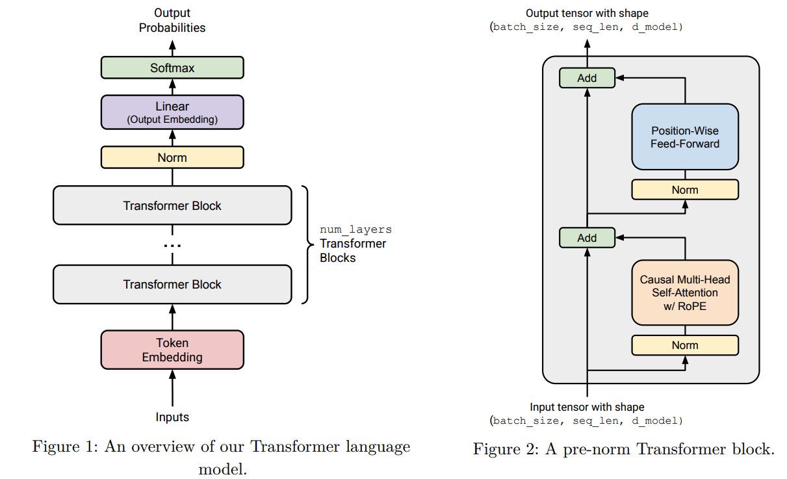

# Transformer Architecture from Scratch

Repo: [`zhL-d/llm-from-scratch`](https://github.com/zhL-d/stf-assignment1-basics)

- [PR #2](https://github.com/zhL-d/stf-assignment1-basics/pull/2) "feature/transformer"

Every component built from raw PyTorch tensor
ops, no `nn.Transformer`, no `HuggingFace`. This covers the building blocks in
the order they were built.



## Linear

- [`2c863e1`](https://github.com/zhL-d/stf-assignment1-basics/commit/2c863e1) "add Linear transformation module"
- [`79d8ca0`](https://github.com/zhL-d/stf-assignment1-basics/commit/79d8ca0) "correct weight initialization and forward pass"
- [`a0ace07`](https://github.com/zhL-d/stf-assignment1-basics/commit/a0ace07) "update weight loading to use correct state dict format"

### Code

[Full file](https://github.com/zhL-d/stf-assignment1-basics/blob/a0ace07/cs336_basics/linear_module.py#L1-L22)

### Method

Use [Xavier/Glorot initialization](https://proceedings.mlr.press/v9/glorot10a.html) (the truncated-normal variant) for weight initialization here.

$$
\mathcal{N}\left(\mu = 0, \sigma^2 = \frac{2}{d_{in} + d_{out}}\right)
\text{ truncated at } [-3\sigma, 3\sigma]
$$

No bias term, following most modern LLMs.

### Note

Why Initialization Matters?

[Derivation process](../evidence/initialization.pdf)

## Embedding

- [`27b8015`](https://github.com/zhL-d/stf-assignment1-basics/commit/27b8015) "implement Embedding module"

### Code

[Full file](https://github.com/zhL-d/stf-assignment1-basics/blob/7565eaa/cs336_basics/embedding.py#L1-L26)

### Method

`self.W[token_ids]` does the whole lookup: `token_ids` is
`(batch_size, sequence_length)`, indexing the `(vocab_size, embedding_dim)`
table with it produces `(batch_size, sequence_length, embedding_dim)`
directly, PyTorch's indexing handles the batching.

## RMSNorm

- [`14ca90d`](https://github.com/zhL-d/stf-assignment1-basics/commit/14ca90d) "implement RMSNorm module"
- [`da2e69f`](https://github.com/zhL-d/stf-assignment1-basics/commit/da2e69f) "correct parameter initialization and method name"
- [`9b7c62f`](https://github.com/zhL-d/stf-assignment1-basics/commit/9b7c62f) "correct divisor reshaping"
- [`c44e6d5`](https://github.com/zhL-d/stf-assignment1-basics/commit/c44e6d5) "simplify forward method"
- [`9062a58`](https://github.com/zhL-d/stf-assignment1-basics/commit/9062a58) "correct parameter initialization to use ones"
- [`f2b31a7`](https://github.com/zhL-d/stf-assignment1-basics/commit/f2b31a7) "add RMSNorm(einx version)"

### Code

[Full file](https://github.com/zhL-d/stf-assignment1-basics/blob/f2b31a7/cs336_basics/rmsnorm_einx.py#L1-L35)

### Method

RMSNorm rescales each activation by the root-mean-square of the whole
vector, then applies a learnable per-dimension gain:

$$\text{RMS}(a) = \sqrt{\frac{1}{d_{model}}\sum_{i=1}^{d_{model}} a_i^2 + \epsilon}$$

$$\text{RMSNorm}(a_i) = \frac{a_i}{\text{RMS}(a)} \cdot g_i$$

`g_i` is the learnable gain, one per dimension (`d_model` of them total), and `eps` is a small constant (`1e-5` here) that
just keeps the division from blowing up if `RMS(a)` is ever near zero.

Casting to `float32` before the reduction and back to the original dtype after 
so the squared values don't overflow

### Note

**Why normalize at all**: 

[Derivation process](../evidence/initialization.pdf)

**Why RMSNorm over LayerNorm(J. L. Ba et al., 2016)**: [LayerNorm](https://arxiv.org/abs/1607.06450) re-centers (subtracts the mean)
and rescales (divides by standard deviation), with a learnable scale and
shift. RMSNorm's premise [(Zhang & Sennrich, 2019)](https://arxiv.org/abs/1910.07467) is that the re-centering
step contributes little to the benefit, the rescaling is what actually
stabilizes training. So RMSNorm drops the mean subtraction and the shift
parameter entirely, only rescaling by the root-mean-square, and keeps a
single learnable gain (`self.g`). Cheaper (no mean to compute) for close to the same effect.

## SwiGLU (position-wise feed-forward)

- [`3f59e2b`](https://github.com/zhL-d/stf-assignment1-basics/commit/3f59e2b) "implement PWFFN class"
- [`4aa595a`](https://github.com/zhL-d/stf-assignment1-basics/commit/4aa595a) "add PWFFN class implementation(einx version)"

### Code

[Full file](https://github.com/zhL-d/stf-assignment1-basics/blob/4aa595a/cs336_basics/positionwise_feedforward_einx.py#L1-L30)

### Method

The original Transformer's feed-forward is two matrices with a ReLU in
between, `FFN(x) = max(0, xW_1)W_2`. SiLU (also called Swish) is a smoother
alternative to ReLU:

$$\text{SiLU}(x) = x \cdot \sigma(x) = \frac{x}{1+e^{-x}}$$

Gated Linear Unit ([Dauphin et al., 2017](https://arxiv.org/abs/1612.08083)):

$$\text{GLU}(x, W_1, W_2) = \sigma(W_1x) \odot W_2x$$

SwiGLU:

$$\text{FFN}(x) = W_2 \big( \text{SiLU}(W_1x) \odot W_3x \big)$$


### Note

**Why position-wise feed-forward exists**

**Why SwiGLU over a plain ReLU MLP**: Shazeer's own paper is refreshingly
honest about why the gated version works better: "we attribute their
success, as all else, to divine benevolence." Empirically it just does.

**How to understand Gated Linear Units are suggested to “reduce the vanishing gradient problem for deep architectures by providing a linear path for the gradients while retaining non-linear capabilities.”**:

The core idea: in a normal deep stack of layers, gradients shrink as they flow backward. Backprop uses the chain rule, so the gradient reaching an early layer is a product of all the local derivatives from every layer after it. If those local derivatives are each less than 1 (which happens with saturating activations like sigmoid/tanh, whose derivative approaches 0 for large inputs), multiplying many of them together shrinks toward zero exponentially with depth — that's the vanishing gradient problem. Early layers end up barely updating.

Now look at the GLU formula:

$$\text{GLU}(x, W_1, W_2) = \sigma(W_1x) \odot W_2x$$

Notice it has two branches, and only one of them (σ(W1x)) goes through a nonlinearity, the other (W2x) is a pure linear transformation, no squashing function applied to it at all.

Providing a linear path for the gradients" refers to that second branch. If you take the derivative of the whole expression with respect to x (product rule, since it's a product of two things), one of the resulting terms is σ(W1x) ⊙ W2, gradient flowing through the linear branch, scaled by the gate value (a number between 0 and 1), but not additionally squashed by the derivative of a saturating function. That's the "linear path": at least one route through the layer lets gradients pass through basically unimpeded by a shrinking derivative, the same reason residual/skip connections help deep networks train, an unobstructed route for gradients to flow backward.

While retaining non-linear capabilities" is the other half: despite that linear path existing, the output of GLU is still nonlinear overall, because of the multiplicative gating with σ(W1x). If you removed the gate and only kept the linear branch, stacking layers would collapse into one big linear transformation no matter how deep (linear-times-linear-times-linear is still just linear), you'd gain nothing from depth. The gate is what keeps the network able to learn genuinely complex, non-linear functions, while the linear branch is what keeps gradients flowing well through many stacked layers.

Tying it back to your own code: SwiGLU (W2(SiLU(W1x) ⊙ W3x)) has the exact same shape, W3x is the linear branch, SiLU(W1x) is the gate, so this same gradient-flow argument applies directly to the PWFFN you implemented, not just the abstract GLU formula.

**Why multiple of 64 better use of GPU tensor cores**:
The cost of the extra matrix is why `d_ff = 8/3 * d_model` instead of the
usual `4 * d_model`: three matrices at `8/3 * d_model` (`3 * 8/3 = 8`)
match the total parameter count of two matrices at `4 * d_model`
(`2 * 4 = 8`), same parameter budget, gated instead of plain. In practice
`8/3 * d_model` is rounded to the nearest multiple of 64, better use of
GPU tensor cores, which operate on fixed-size tiles. This repo's own
config (`d_model=512`) uses `d_ff=1344`, `round(8/3 * 512 / 64) * 64 = 1344`, matching that convention exactly.

## RoPE (rotary positional encoding)

- [`c24ab02`](https://github.com/zhL-d/stf-assignment1-basics/commit/c24ab02) "init rope"
- [`710bfed`](https://github.com/zhL-d/stf-assignment1-basics/commit/710bfed) "use float32 for meshgrid and correct tensor dimensions"
- [`29aa390`](https://github.com/zhL-d/stf-assignment1-basics/commit/29aa390) "correct angle_k range (1-based not 0-based)"
- [`8f7d579`](https://github.com/zhL-d/stf-assignment1-basics/commit/8f7d579) "implement RoPe class(einx + optimize)"

### Code

[Full file](https://github.com/zhL-d/stf-assignment1-basics/blob/8f7d579/cs336_basics/rope_einx.py#L1-L49)

### Method

**Why RoPE at all**: attention itself has no notion of token order, it's
permutation-invariant, shuffle the tokens and attention's output
shuffles the same way, nothing about the computation itself changes. So
without injecting position somehow, the model can't tell "A before B"
from "B before A". RoPE's fix: instead of adding a position vector to
the embedding (what the original Transformer did), rotate every pair of
elements in each query/key vector by an angle proportional to its
position, applied directly inside attention.

**How**: split a query token $q^{(i)} = W_q x^{(i)} \in \mathbb{R}^d$ at
position $i$ into $d/2$ independent 2D pairs, $q^{(i)}_{2k-1:2k}$ for
$k \in \{1, ..., d/2\}$, and rotate every pair by an angle that grows
with position $i$ and shrinks across pair index $k$:

$$\theta_{i,k} = \frac{i}{\Theta^{(2k-2)/d}}$$

for some constant $\Theta$. To rotate a pair by $\theta_{i,k}$, multiply
it by the 2D rotation matrix

$$
R^i_k = \begin{pmatrix} \cos(\theta_{i,k}) & -\sin(\theta_{i,k}) \\
\sin(\theta_{i,k}) & \cos(\theta_{i,k}) \end{pmatrix}
$$

Stacking all $d/2$ of these blocks along the diagonal (everything off
the block diagonal is `0`) gives the rotation for the whole vector at
once:

$$
R^i = \begin{pmatrix}
R^i_1 & 0 & 0 & \cdots & 0 \\
0 & R^i_2 & 0 & \cdots & 0 \\
0 & 0 & R^i_3 & \cdots & 0 \\
\vdots & \vdots & \vdots & \ddots & \vdots \\
0 & 0 & 0 & \cdots & R^i_{d/2}
\end{pmatrix}
\qquad q'^{(i)} = R^i q^{(i)} = R^i W_q x^{(i)}
$$

The exact same rotation is applied to the key $k^{(j)}$ at its own
position `j`, using $R^j$ instead. $theta_{i,k}$ depends only on
position `i` and pair index `k`, never on the input values themselves,
so this layer has no learnable parameters, `theta` and `Theta` are
fixed, not trained.

**The problem**: $R^i$ is `d x d`, but almost entirely zeros, only the
`d/2` diagonal `2x2` blocks are non-zero. Materializing that full matrix
and running a real `d x d` matmul against it wastes memory and compute
on every one of those zero entries.

**The simplification**: because $R^i$ is block-diagonal (the matrix
defined above), matrix-vector multiplication distributes over the
blocks, row-block `k` of $R^i q^{(i)}$ only ever involves block `k` of
$q^{(i)}$, every other entry multiplying it in that row is `0`:

$$\left(R^i q^{(i)}\right)_k = R^i_k \, q^{(i)}_{2k-1:2k}, \qquad k = 1, \dots, d/2$$

So multiplying the full $R^i$ against $q^{(i)}$ is mathematically
identical to multiplying each `2x2` block $R^i_k$ against only its
matching pair, independently. Working block-by-block, $R^i_k$ against its pair
`(x_even, x_odd)` directly gives the closed form:

$$
R^i_k \begin{pmatrix} x_{even} \\ x_{odd} \end{pmatrix} =
\begin{pmatrix} x_{even}\cos\theta_{i,k} - x_{odd}\sin\theta_{i,k} \\
x_{even}\sin\theta_{i,k} + x_{odd}\cos\theta_{i,k} \end{pmatrix}
$$

which is exactly two elementwise multiply-adds, `RoPe.forward`'s actual
computation, no matrix ever built or multiplied:

```python
x_even_rot = x_even * cos_pos - x_odd * sin_pos
x_odd_rot  = x_even * sin_pos + x_odd * cos_pos
```

So `RoPe` never builds $R^i$ at all, it only ever needs
`cos(theta_{i,k})` and `sin(theta_{i,k})`, shape `(max_seq_len, d_k/2)`,
precomputed once in `__init__` and stored as buffers
(`register_buffer(persistent=False)`, not `nn.Parameter`, since these
values are fixed, not learned) and reused across every layer, batch, and
forward pass, 4x less memory than the `(max_seq_len, d_k/2, 2, 2)` full
rotation-matrix buffer the first version used, and elementwise
multiply-add replaces many tiny matmuls, cheaper on GPU. `forward` then
just looks up the precomputed `cos_pos`/`sin_pos` at the actual
`token_positions` passed in and applies the two lines above to every
pair.

### Note

**Q: Why does the attention term $q^\top k$ automatically become
dependent only on the relative position $j-i$ after rotating both `q`
and `k` in this manner?**

A: rotation matrices satisfy `(R^i)^T = R^{-i}` (transposing reverses
the angle) and `R^i R^j = R^{i+j}` (composing two rotations adds their
angles). So for the rotated query at position `i` and rotated key at
position `j`:

$$(R^i q)^T (R^j k) = q^T (R^i)^T R^j k = q^T R^{j-i} k$$

The result depends only on `q`, `k`, and the *difference* `j - i`, the
absolute positions `i` and `j` cancel out entirely. That's the whole
point: attention scores computed this way are automatically a function
of relative distance, which is why RoPE generalizes to sequence lengths
longer than anything seen in training, additive position embeddings have
no equivalent guarantee.

## Multi-Head Self-Attention

- [`87e6898`](https://github.com/zhL-d/stf-assignment1-basics/commit/87e6898) "add Softmax function"
- [`f84de5e`](https://github.com/zhL-d/stf-assignment1-basics/commit/f84de5e) "init SDPAttention class"
- [`841f2ec`](https://github.com/zhL-d/stf-assignment1-basics/commit/841f2ec) "update SDPAttention class"
- [`996f560`](https://github.com/zhL-d/stf-assignment1-basics/commit/996f560) "fix: add SDPAttention class"
- [`81221cd`](https://github.com/zhL-d/stf-assignment1-basics/commit/81221cd) "init MultiHeadSelfAttention class"
- [`465d8b8`](https://github.com/zhL-d/stf-assignment1-basics/commit/465d8b8) "fix: correct method name from state_dict to load_state_dict"
- [`7159f70`](https://github.com/zhL-d/stf-assignment1-basics/commit/7159f70) "implement MultiHeadSelfAttentionRope"

### Softmax

#### Code

[Full file](https://github.com/zhL-d/stf-assignment1-basics/blob/9918a0f/cs336_basics/softmax_einx.py#L1-L11)


#### Method

Attention needs `softmax` as a building block first, the operation that
turns an unnormalized vector of scores into a normalized distribution:

$$\text{softmax}(v)_i = \frac{\exp(v_i)}{\sum_{j=1}^n \exp(v_j)}$$

**Numerical stability**: $exp(v_i)$ can overflow to `inf` for large
$v_i$, and `inf/inf` is `NaN`. Softmax is invariant to adding any
constant `c` to every input (`c` cancels between numerator and
denominator, $exp(v_i+c)/sum(exp(v_j+c)) = exp(v_i)/sum(exp(v_j))$), so
subtracting `max(v)` from every element first, making the new max `0`,
avoids the overflow without changing the result.

### Scaled dot-product attention

#### Code

[Full file](https://github.com/zhL-d/stf-assignment1-basics/blob/996f560/cs336_basics/scaled_dot_product_attention.py#L1-L28)

#### Method

Scaled dot-product attention itself:

$$\text{Attention}(Q, K, V) = \text{softmax}\left(\frac{QK^T}{\sqrt{d_k}}\right)V$$

with $Q \in \mathbb{R}^{n \times d_k}$, $K \in \mathbb{R}^{m \times d_k}$,
$V \in \mathbb{R}^{m \times d_v}$, all inputs to the operation, not
learnable parameters themselves, the learnable projections live one
level up, in `W_Q`/`W_K`/`W_V` below.

**Masking**: a boolean mask $M \in \{\text{True}, \text{False}\}^{n \times m}$
marks which keys each query is allowed to attend to, `True` at `(i, j)`
means query `i` *does* attend to key `j`. Rather than physically
excluding masked positions (which would mean recomputing attention once
per prefix), masking is folded directly into softmax: add `-inf` to
every `(i, j)` entry of the pre-softmax scores `QK^T / sqrt(d_k)` where
the mask is `False`. `exp(-inf) = 0`, so those positions get exactly zero
attention weight after softmax, in one pass, same cost as the unmasked
version:

$$\text{Attention}(Q, K, V) = \text{softmax}\left(\frac{QK^T}{\sqrt{d_k}} + \text{mask}\right)V$$

### MultiHeadSelfAttention

#### Code

[Full file](https://github.com/zhL-d/stf-assignment1-basics/blob/81221cd/cs336_basics/multihead_self_attention.py#L1-L54)


#### Method

Projects `x` through `Q`/`K`/`V`, reshapes each into `num_heads` separate
chunks, builds a causal mask (`~torch.triu(..., diagonal=1)`, upper
triangle excluded so position `i` can't see positions `> i`), runs
`SDPAttention` once across all heads at once, then concatenates the heads
back together and projects through `W_O`. 

Multi-head splits `Q`, `K`, `V` into `num_heads` independent, smaller
attention computations run in parallel:

$$\text{MultiHead}(Q, K, V) = \text{Concat}(\text{head}_1, ..., \text{head}_h), \quad \text{head}_i = \text{Attention}(Q_i, K_i, V_i)$$

then concatenates the results and projects back down with a final output
matrix `W_O`, giving multi-head *self*-attention (`x` projected through
`W_Q`/`W_K`/`W_V` supplies the `Q`/`K`/`V` above):

$$\text{MultiHeadSelfAttention}(x) = W_O \, \text{MultiHead}(W_Q x, W_K x, W_V x)$$

with learnable $W_Q \in \mathbb{R}^{hd_k \times d_{model}}$,
$W_K \in \mathbb{R}^{hd_k \times d_{model}}$,
$W_V \in \mathbb{R}^{hd_v \times d_{model}}$,
$W_O \in \mathbb{R}^{d_{model} \times hd_v}$.


### MultiHeadSelfAttentionRope

#### Code

[Full file](https://github.com/zhL-d/stf-assignment1-basics/blob/7159f70/cs336_basics/multihead_self_attention_rope.py#L1-L59)

#### Method

MultiHeadSelfAttentionRope integrates RoPE.

### Note

**Why attention exists**: the feed-forward processes each position in
isolation; attention is the only place a token's representation actually
gets updated based on other tokens. It's how the model builds context.

**Why scaled by `sqrt(d_k)`**: assume `Q` and `K`'s entries are
independent, mean-0, variance-1 (roughly true after initialization).
`Q · K = sum_{i=1}^{d_k} q_i k_i` is a sum of `d_k` independent terms,
each with variance `Var(q_i k_i) = Var(q_i) Var(k_i) = 1`, so
`Var(Q · K) = d_k`, growing linearly with `d_k`. Left unscaled, for large
`d_k` the softmax input has large-magnitude entries, which pushes softmax
into a saturated regime, one entry close to 1, the rest close to 0, with
almost no gradient anywhere. Dividing by `sqrt(d_k)` scales the variance
back down by a factor of `d_k`, `Var(Q·K / sqrt(d_k)) = d_k / d_k = 1`,
constant regardless of dimension, keeping softmax (and its gradient)
well-behaved.

**Why a causal mask**: this is a language model, predict the next token
from the ones before it. Without a mask, position `i` could attend to
position `i+1` and beyond, which is the answer leaking into the question,
trivializing the training objective. Setting those positions
to `-inf` before softmax, exactly the masking mechanism above with
`mask[i, j] = -inf` for `j > i`, makes their attention weight exactly 0.

**Why multiple heads instead of one wide attention**: splitting into
smaller, independent attention computations run in parallel lets each head
learn to specialize, one might track local/positional patterns, another
longer-range syntactic relationships, rather than a single attention
computation having to represent every kind of relationship in the same
space at once.

## TransformerBlock

- [`95c4752`](https://github.com/zhL-d/stf-assignment1-basics/commit/95c4752) "init TransformerBlock class"
- [`5f8a7a9`](https://github.com/zhL-d/stf-assignment1-basics/commit/5f8a7a9) "include token positions in multi-head attention"

### Code

[Full file](https://github.com/zhL-d/stf-assignment1-basics/blob/5f8a7a9/cs336_basics/transformer_block.py#L1-L39)

### Method

Assembles RMSNorm, attention, and the feed-forward into one block, two
sub-layers, each wrapped in a residual connection:

**Why pre-norm**: notice the residual line, `x + embedding_attention`, adds
back the raw `x`, not `x_norm`. RMSNorm is only applied to what feeds
into attention/the feed-forward, never to the residual path itself. This
is "pre-norm," and it's the standard in GPT-2, LLaMA, and PaLM, as opposed
to the original 2017 Transformer's "post-norm" (normalize after adding
the residual). The reason: with post-norm, every layer's gradient has to
pass back through a normalization operation on the main residual path.
Pre-norm keeps that path completely linear, an unobstructed route for
gradients across many stacked layers, the same "linear path" idea behind
GLU's gradient advantage.

[Derivation process](../evidence/pre_norm.md)

### Note

**Q: Why use a residual connection at all?**

A: Each sub-layer in `TransformerBlock.forward` is wrapped as
`x + sublayer(norm(x))` rather than just `sublayer(norm(x))`:

$$x_1 = x + \text{Attention}(\text{RMSNorm}(x)), \qquad x_2 = x_1 + \text{FFN}(\text{RMSNorm}(x_1))$$

matching `result_firstsublayer = x + embedding_attention` and
`result_secondsublayer = result_firstsublayer + embedding_pwffn` in the
code. Two reasons this matters, both about what happens once many of
these blocks are stacked:

- **Gradient flow.** By the chain rule, $d(x + f(x))/dx = I + df/dx$, the
  identity term is always there regardless of what `f` (attention or the
  feed-forward) computes. Backprop through `N` stacked blocks multiplies
  `N` of these Jacobians together, and because every one of them contains
  an identity component, the gradient always has at least one path
  straight back to the input that isn't shrunk or distorted by any
  sub-layer, the same "unobstructed path" idea as pre-norm and GLU's
  linear branch above, just at the level of whole sub-layers instead of
  inside one of them. Without the `x +`, gradients would have to pass
  through every attention and feed-forward Jacobian in sequence, and if
  any of those have small-magnitude derivatives, the product vanishes
  with depth.
- **Easier optimization target.** Each sub-layer only has to learn a
  *residual* (a correction to add), not a full replacement for its
  input. At initialization a sub-layer's output is close to `0` (small
  random weights), so early in training `x + sublayer(x) ~ x`, the block
  starts out close to the identity function and training only has to
  learn how much to perturb it, rather than having to learn the identity
  mapping from scratch just to pass information through unchanged, which
  a plain (non-residual) deep stack would otherwise need every layer to
  discover on its own.

## TransformerLM

- [`3ade172`](https://github.com/zhL-d/stf-assignment1-basics/commit/3ade172) "implement TransformerLM class"
- [`92b25f0`](https://github.com/zhL-d/stf-assignment1-basics/commit/92b25f0) "refactor block initialization(ModuleList)"
- [`411a24f`](https://github.com/zhL-d/stf-assignment1-basics/commit/411a24f) "fix load_state_dict() strict=True bug; change loop pattern"
- [`e4d5f5b`](https://github.com/zhL-d/stf-assignment1-basics/commit/e4d5f5b) merged as [PR #2](https://github.com/zhL-d/stf-assignment1-basics/pull/2)

### Code

[Full file](https://github.com/zhL-d/stf-assignment1-basics/blob/411a24f/cs336_basics/transformer_lm.py#L1-L51)

### Method

Stacks `num_layers` `TransformerBlock`s between an embedding and a final
embed tokens, run every block in sequence, one final RMSNorm,
project to vocabulary-sized logits.


## Cross-Entropy Loss

- [`e2c72f9`](https://github.com/zhL-d/stf-assignment1-basics/commit/e2c72f9) "Implement CrossEntropy function"

### Code

[Full file](https://github.com/zhL-d/stf-assignment1-basics/blob/e2c72f9/cs336_basics/cross_entropy.py#L1-L13)

### Method

A language model is trained to predict the next token from everything
before it. Over a whole dataset, the training objective is the average
negative log-likelihood the model assigns to the actual next token, at
every position, in every sequence:

$$\ell(\theta; D) = \frac{1}{|D|}\frac{1}{m}\sum_{x \in D}\sum_{i=1}^{m} -\log p_\theta(x_{i+1} \mid x_{1:i})$$

`TransformerLM`'s forward pass produces logits `o_i`, one vector of size
`vocab_size` per position, and the model's predicted probability for the
actual next token is just that position's softmax, indexed at the true
token:

$$p_\theta(x_{i+1} \mid x_{1:i}) = \text{softmax}(o_i)[x_{i+1}] = \frac{\exp(o_i[x_{i+1}])}{\sum_{a=1}^{V} \exp(o_i[a])}$$

Plugging that into `-log(...)` and simplifying is worth writing out fully
rather than just stating the result (from
[`cross_entropy_derivation.md`](https://github.com/zhL-d/stf-assignment1-basics/blob/e2c72f9/cs336_basics/cross_entropy_derivation.md)
in the repo):

$$-\log\big(\text{softmax}(o_i)[x_{i+1}]\big) = -\log\left(\frac{\exp(o_i[x_{i+1}])}{\sum_{a=1}^{V}\exp(o_i[a])}\right)$$

Let $A = \exp(o_i[x_{i+1}])$ and $B = \sum_{a=1}^{V}\exp(o_i[a])$. Using
$-\log(A/B) = \log B - \log A$, and $\log(\exp(x)) = x$ to cancel the
$\log$ against the $\exp$ inside $A$:

$$-\log\left(\frac{A}{B}\right) = \log(B) - \log(A) = \log\left(\sum_{a=1}^{V}\exp(o_i[a])\right) - o_i[x_{i+1}]$$

So the loss for one position collapses to "log-sum-exp of all the logits,
minus the target logit", no need to ever materialize the full softmax
distribution just to throw most of it away, and the `log(exp(...))` in
`A` cancels algebraically before it's ever computed, one less
numerically risky operation. Same numerical-stability trick as `Softmax`
still applies: subtract the max logit before exponentiating anything.

### Note

[Derivation Process](../../cs336_basics/cross_entropy_derivation.md)

## AdamW

- [`979e9ba`](https://github.com/zhL-d/stf-assignment1-basics/commit/979e9ba) "init adamw"
- [`dd2c366`](https://github.com/zhL-d/stf-assignment1-basics/commit/dd2c366) "update adamw"

### Code

[Full file](https://github.com/zhL-d/stf-assignment1-basics/blob/dd2c366/cs336_basics/adamw.py#L1-L45)

### Method

**What the algorithm is doing, and why**: plain SGD takes the same-size
step for every parameter, scaled only by a single global learning rate,
`theta <- theta - lr * grad`. That's a poor fit for a network with
millions of parameters whose gradients differ wildly in scale and
noisiness, some parameters see large, consistent gradients step after
step, others see small, noisy ones, but SGD treats them identically. Adam
([D. P. Kingma et al., 2015](https://arxiv.org/abs/1412.6980)) fixes
this by giving *each parameter its own adaptive step size*, computed
from that parameter's own gradient history, using two running averages:

- `m`, an exponential moving average of the gradient itself, a
  smoothed estimate of *which direction* this parameter should move,
  averaging out noise from any single batch (this is the "momentum"
  half, same idea as classical SGD-with-momentum).
- `v`, an exponential moving average of the squared gradient, an
  estimate of *how large and volatile* this parameter's gradients
  typically are.

The update then divides the smoothed direction `m` by
`sqrt(v)`, dividing by a large `v` shrinks the step for parameters with
consistently large/noisy gradients, dividing by a small `v` grows the
step for parameters with small/quiet gradients, so every parameter
effectively gets its own learning rate that adapts over training,
instead of one global `lr` applied uniformly. `AdamW` is Adam
with decoupled weight decay
([I. Loshchilov et al., 2019](https://arxiv.org/abs/1711.05101)): weight
decay pulls every parameter toward `0` a little each step, and "decoupled"
means that pull is applied directly to `theta`, separately from the
gradient, rather than mixed into the gradient first (as plain L2
regularization would do), so the moment estimates below stay driven
purely by the loss gradient, not contaminated by the decay term.

Concretely, per parameter, per step:

$$m \leftarrow \beta_1 m + (1-\beta_1) g$$

$$v \leftarrow \beta_2 v + (1-\beta_2) g^2$$

$$\alpha_t \leftarrow \alpha \frac{\sqrt{1-\beta_2^t}}{1-\beta_1^t}$$

$$\theta \leftarrow \theta - \alpha \lambda \theta \qquad \text{(weight decay)}$$

$$\theta \leftarrow \theta - \alpha_t \frac{m}{\sqrt{v}+\epsilon} \qquad \text{(moment-adjusted update)}$$


## Learning Rate Schedule

- [`9e6c118`](https://github.com/zhL-d/stf-assignment1-basics/commit/9e6c118) "cosine annealing learning rate schedule"
- [`1a33b29`](https://github.com/zhL-d/stf-assignment1-basics/commit/1a33b29) "implement gradient clipping"
- [`024bc11`](https://github.com/zhL-d/stf-assignment1-basics/commit/024bc11) "fix" (gradient clipping)

### Code

[Full file](https://github.com/zhL-d/stf-assignment1-basics/blob/9e6c118/cs336_basics/learning_rate_schedule.py#L1-L26)

### Method

The learning rate that gives the fastest loss decrease isn't constant
across training, so instead of one fixed value, a *schedule* is a
function of the current step `t` (plus a few fixed parameters) that
returns the learning rate to use at that step. This implements the
cosine annealing schedule used to train LLaMA
([H. Touvron et al., 2023](https://arxiv.org/abs/2302.13971)), taking
five inputs: the current iteration `t`, max learning rate `alpha_max`,
min (final) learning rate `alpha_min`, number of warm-up iterations
`T_w`, and the final iteration of annealing `T_c`. Three regimes:

**Warm-up** (`t < T_w`): ramp linearly from `0` up to `alpha_max`,

$$\alpha_t = \frac{t}{T_w}\alpha_{max}$$

**Cosine annealing** (`T_w <= t <= T_c`): decay from `alpha_max` down to
`alpha_min` following one half-period of a cosine curve,

$$\alpha_t = \alpha_{min} + \frac{1}{2}\left(1 + \cos\left(\frac{t-T_w}{T_c-T_w}\pi\right)\right)(\alpha_{max}-\alpha_{min})$$

**Post-annealing** (`t > T_c`): hold flat at `alpha_min`,

$$\alpha_t = \alpha_{min}$$

**Why warm up at all**: early in training `m`/`v` (AdamW's moment
estimates, see [AdamW](#adamw) above) have seen almost no gradients yet,
they're a poor, high-variance estimate of the true gradient direction. A
large step in a possibly-wrong direction this early can destabilize
training before it gets going. Ramping the learning rate up linearly
gives the moment estimates time to become reliable before the model ever
takes a full-sized step.

**Why cosine, not linear, decay**: a cosine curve stays close to
`alpha_max` for a while after warm-up ends (slope near `0` at `t=T_w`),
so training keeps making fast progress in the early-to-middle phase, then
the decay accelerates through the middle of the curve and flattens again
approaching `alpha_min` (slope near `0` at `t=T_c`), landing softly on
the final learning rate instead of cutting it off abruptly. A straight
linear ramp down would decay at the same rate throughout, cosine spends
more of the schedule near the two extremes and less time in a rushed
middle transition.


## Gradient Clipping

### Code

[Full file](https://github.com/zhL-d/stf-assignment1-basics/blob/024bc11/cs336_basics/gradient_clipping.py#L1-L25)

### Method

Some training batches produce unusually large gradients, which can
destabilize training with a step far too big for the current loss
landscape. Gradient clipping enforces a hard ceiling on gradient
magnitude, after the backward pass but before the optimizer step uses it.

Crucially, this is one global norm across *every* parameter's gradient at
once, `g` below means the concatenation of every parameter's gradient
into one long vector, not a separate clip per parameter:

$$\|g\|_2 = \sqrt{\sum_i g_i^2}$$

If that norm is already under the max `M`, leave `g` untouched. Otherwise
rescale the whole gradient vector down by a single factor so its norm
lands just under `M`:

$$g \leftarrow \frac{M}{\|g\|_2 + \epsilon} \, g$$

Scaling every component by the same factor preserves the gradient's
*direction*, only shrinking its magnitude, so clipping caps step size
without redirecting the update. `eps` (`1e-6` here) only guards against
dividing by a near-zero norm; since `M` is being divided by a value
strictly larger than `|g|_2`, the resulting norm always lands just under
`M`, never touching it exactly.

### Note

**Why clip the global norm and not each parameter separately**: clipping
per-parameter would change the relative scale between parameters, one
weight matrix could get clipped hard while another right next to it
passes through untouched, distorting the direction of the overall update
across the model. A single global norm clips the whole gradient vector
uniformly, preserving how parameters move relative to each other, it
only reins in the update's overall magnitude.

## Checkpointing

- [`dab8744`](https://github.com/zhL-d/stf-assignment1-basics/commit/dab8744) "Implement checkpointing functionality"

### Code

[Full file](https://github.com/zhL-d/stf-assignment1-basics/blob/dab8744/cs336_basics/checkpointing.py#L1-L46)


### Method

Training jobs get interrupted, a job times out, a machine fails, and
even when nothing goes wrong, it's useful to keep intermediate models
around (to inspect training dynamics later, or sample from an earlier
stage). A checkpoint needs to hold everything required to resume
training from exactly where it stopped, not just the model:

- **Model weights**: `model.state_dict()`, every `nn.Module` provides
  this, a dict of every learnable parameter.
- **Optimizer state**: `optimizer.state_dict()`. AdamW is *stateful*
  (see [AdamW](#adamw) above), it keeps a running `m`/`v` per parameter,
  losing that state on resume would silently restart the moment
  estimates from `0`, throwing away everything AdamW learned about the
  gradient's recent behavior.
- **Iteration number**: a plain `int`, needed to resume the learning
  rate schedule ([Learning Rate Schedule](#learning-rate-schedule) above)
  at the right point in its warm-up/annealing curve, rather than
  restarting it from `t=0`.

All three go into one dict and get handed to `torch.save`, which
serializes tensors and plain Python values (the `int` included) together
to a single file. `load_checkpoint` reverses this: `torch.load` deserializes
the dict back, then `model.load_state_dict(...)` and
`optimizer.load_state_dict(...)` restore each piece into an already-
constructed model/optimizer (they mutate in place, they don't build a
new model from scratch), and the iteration number is returned directly
so the training loop knows what `t` to resume counting from.

## Data Loading

- [`e6728ad`](https://github.com/zhL-d/stf-assignment1-basics/commit/e6728ad) "Implement data loading function"
- [`a6b8b2c`](https://github.com/zhL-d/stf-assignment1-basics/commit/a6b8b2c) "tokenize_and_save function(memmap)"
- [`a763caa`](https://github.com/zhL-d/stf-assignment1-basics/commit/a763caa) "init training loop"
- [`e7b5f7e`](https://github.com/zhL-d/stf-assignment1-basics/commit/e7b5f7e) "update training loop"
- [`2439eef`](https://github.com/zhL-d/stf-assignment1-basics/commit/2439eef) "Add logging(Weights and Biases)"
- [`2d6b799`](https://github.com/zhL-d/stf-assignment1-basics/commit/2d6b799) "fix training_together"

### Code

[Full file](https://github.com/zhL-d/stf-assignment1-basics/blob/e6728ad/cs336_basics/data_loading.py#L1-L21)


### Method

The tokenized corpus is one flat sequence of tokens
`x = (x_1, ..., x_n)`. Even when the source data is many separate
documents (web pages, source files), a common practice is to concatenate
all of them into this single sequence first, with a delimiter between
documents (the `<|endoftext|>` token) marking where one ends and the
next begins.

A data loader turns this into a stream of batches: each batch is `B`
sequences of length `m` (`context_length`), paired with the corresponding
next-token targets, also length `m`, that same window shifted by one,
next-token prediction. For `B=1, m=3`:
`([x_2, x_3, x_4], [x_3, x_4, x_5])` is one example batch.

This shape simplifies training for a few concrete reasons:

- **Sampling is trivial**: any `1 <= i <= n - m` is a valid starting
  index for a training sequence, no bookkeeping about document
  boundaries needed.
- **No padding**: every sampled sequence has the exact same length `m`,
  so there's nothing to pad, better hardware utilization (and room for a
  larger `B`, since no capacity gets spent on padding tokens).
- **No need to load the full dataset**: sampling a window only ever
  touches `m` tokens at a time, regardless of how large `n` is.

`DataLoading` implements exactly this: `starts` picks `batch_size`
random indices in `[0, n - context_length)`, `input_idx`/`target_idx`
broadcast each start into a full `context_length`-long window
(`target_idx` is the same window shifted by `+1`), and both get indexed
out of `x` directly.

That last reason is also why the corpus is tokenized once and saved to a
`.npy` file ([`a6b8b2c`](https://github.com/zhL-d/stf-assignment1-basics/commit/a6b8b2c)),
then reopened with `np.load(path, mmap_mode='r')`, memory-mapped rather
than loaded whole into RAM, so `DataLoading` can pull random windows out of
a corpus far larger than memory without ever materializing the whole thing.

## The Training Loop

### Code

[Full file](https://github.com/zhL-d/stf-assignment1-basics/blob/2d6b799/cs336_basics/training_together.py#L1-L233)

### Method


## Decoding

- [`babef66`](https://github.com/zhL-d/stf-assignment1-basics/commit/babef66) "add decoding"
- [`6a8bf0d`](https://github.com/zhL-d/stf-assignment1-basics/commit/6a8bf0d) "fix"
- [`5386f6f`](https://github.com/zhL-d/stf-assignment1-basics/commit/5386f6f) "fix"
- [`eec6d3c`](https://github.com/zhL-d/stf-assignment1-basics/commit/eec6d3c) "add Generate function for model inference"

### Code

[Full file](https://github.com/zhL-d/stf-assignment1-basics/blob/eec6d3c/cs336_basics/decoding.py#L1-L70)

### Method

Autoregressive generation: feed the prompt in, take the last position's
logits, turn them into a distribution, sample one token, append it, repeat
until `max_tokens` or every sequence in the batch has produced an
end-of-text token.

Temperature scales the logits before softmax (same `SoftmaxTemp`, just
dividing by `temp` before exponentiating, lower temperature sharpens the
distribution toward the most likely tokens, higher flattens it toward
uniform), then top-p (nucleus sampling) keeps only the smallest set of
highest-probability tokens whose cumulative probability crosses `p`,
renormalizes just those, and samples from that.

## Inference

[`generate.py`](https://github.com/zhL-d/stf-assignment1-basics/blob/eec6d3c/cs336_basics/generate.py#L1-L55)
is the actual end-to-end inference script tying everything in this whole
post together: load a config, build a `TransformerLM`, load a trained
checkpoint's weights into it, load the tokenizer, encode a prompt, call
`Decoding`, decode the resulting token IDs back to text, print it.


